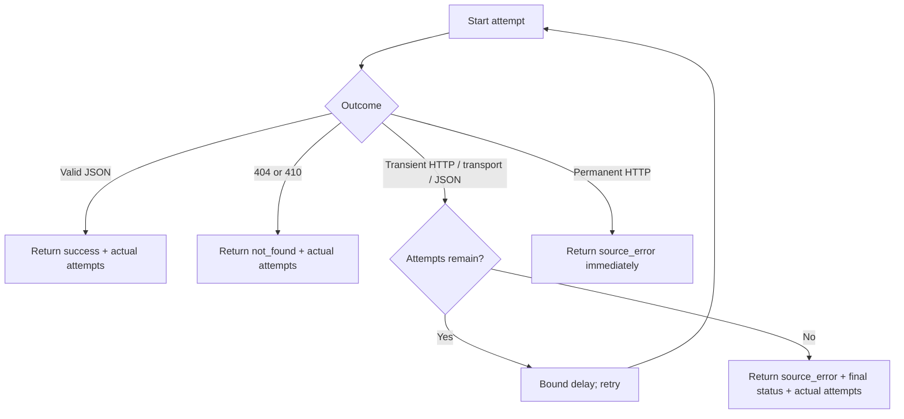

# HTTP retry and accounting design

The live BRREG batch must classify every terminal outcome while reporting the requests it actually
made. Retry behavior is intentionally limited to transient failures; permanent client errors must
not be amplified.

## Numbered pseudocode

1. Start an HTTP attempt and increment the attempt count.
2. If a JSON response succeeds, return its bytes, status, timestamp, and `retry_count = attempts - 1`.
3. If the server returns 404 or 410, return `not_found` immediately with the same retry count.
4. If the server returns 408, 425, 429, or a 5xx response and attempts remain:
   1. Parse a numeric `Retry-After` value when present.
   2. Sleep for the larger of bounded `Retry-After` and exponential backoff.
   3. Retry.
5. If a transient transport/JSON error occurs and attempts remain, apply exponential backoff and
   retry.
6. Return the final error with its real HTTP status when known, the actual response bytes/hash, and
   `retry_count = attempts - 1`.
7. Copy retry count into the evidence record and add `retry_count + 1` to run request metrics.

The diagram source is checked in for review. Rendering is not required by the batch runtime.
