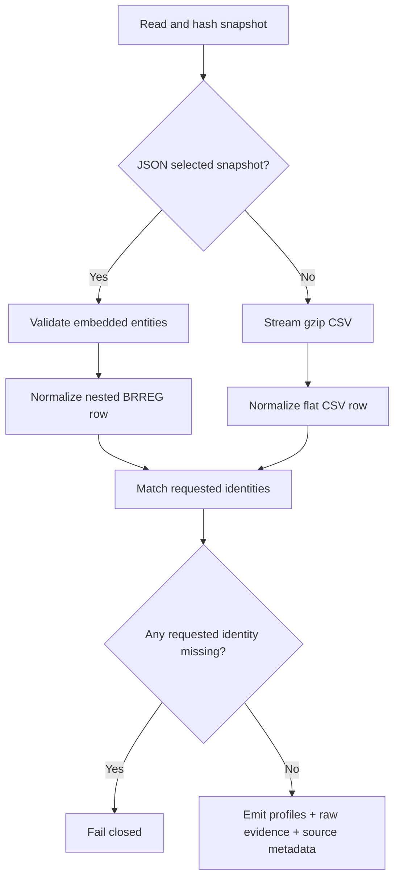

# Selected registry snapshot design

BRREG's official entity-search API accepts up to 2,000 organisation numbers. This gives a bounded,
official identity snapshot for the exact 1,000-company entry manifest when the nationwide bulk file
cannot be transferred reliably.

## Numbered pseudocode

1. Read the input snapshot bytes and hash them before parsing.
2. If the path is a JSON snapshot:
   1. Require an `_embedded.enheter` array.
   2. Normalize each nested BRREG entity without discarding its raw object.
   3. Carry the snapshot's official source URL separately from the raw evidence value.
3. Otherwise, retain the existing streaming gzip/CSV parser unchanged.
4. Select only requested organisation numbers and fail if any requested identity is absent.
5. Attach the complete snapshot hash, exact raw row, source row key, retrieval timestamp, and the
   correct official source URL to registry evidence.
6. Report every distinct snapshot source URL in run metadata.

The Mermaid source is reviewable here; rendering remains optional for the runtime.
